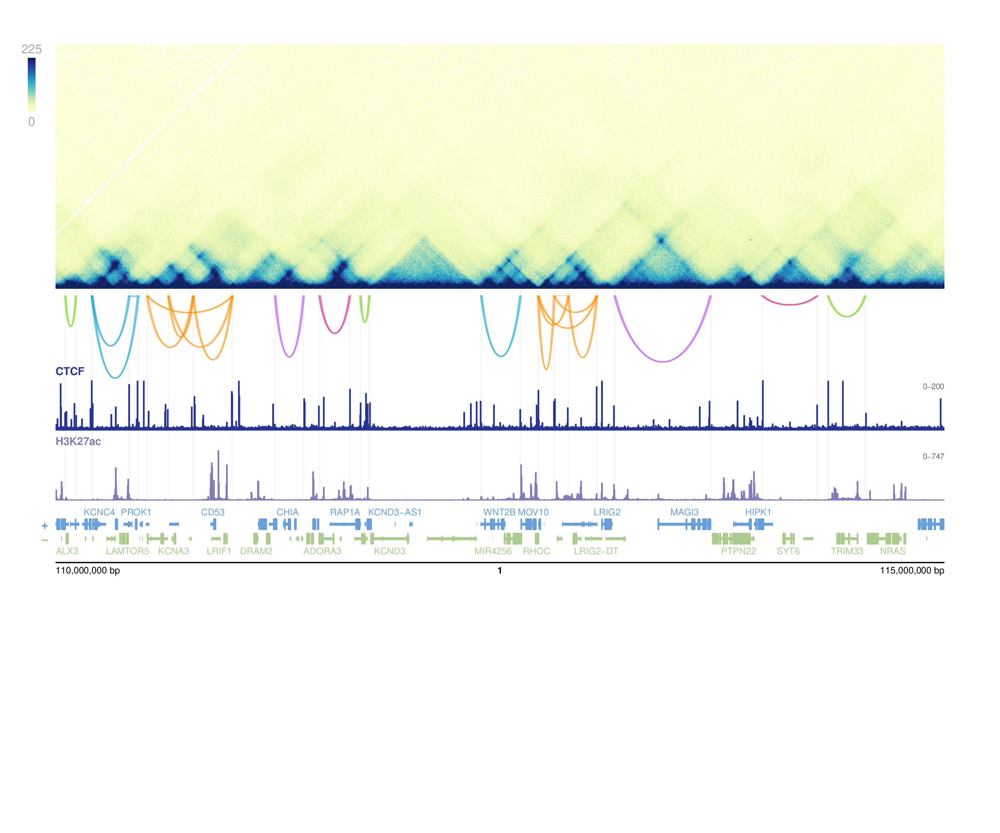

```{r setup, include = FALSE}
knitr::opts_chunk$set(
  collapse = TRUE,
  comment  = "#>",
  eval     = FALSE
)
```

## Overview

A key strength of loopcity is its seamless integration with
[plotgardener](https://phanstiellab.github.io/plotgardener/), a
Bioconductor package for creating precise, publication-quality genomic
visualizations. Because loopcity returns standard `GInteractions` objects,
community calls can be layered directly alongside Hi-C contact maps,
ChIP-seq signal tracks, gene models, and any other genomic data type
supported by plotgardener — all within a single reproducible script.

The example below demonstrates this workflow using K562 Hi-C data and
CTCF/H3K27ac ChIP-seq signal tracks from Bond et al. 2023, showing
loop communities on chromosome 1 (110–115 Mb).

## Run the loopcity pipeline

```{r pipeline}
library(loopcity)
library(data.table)
library(GenomeInfoDb)
library(InteractionSet)
library(mariner)

hic_file   <- "data/processed/hic/GSE214123_MEGA_K562_WT_0_inter.hic"
loops_file <- "data/processed/hic/5kbLoops_0.txt"

loops <- data.table::fread(loops_file) |>
    mariner::assignToBins(binSize = 10e3)
GenomeInfoDb::seqlevelsStyle(loops) <- "ENSEMBL"

merged      <- mergeAnchors(loops, pixelOverlap = 1)
connected   <- connectLoopAnchors(merged, overlapDist = 1e6)
scored      <- scoreInteractions(connected, hicFile = hic_file,
                                 resolution = 10e3, norm = "NONE")
communities <- assignCommunities(interactions(scored),
                                 leidenResolution = 0.5)
```

## Visualize with plotgardener

Once communities are assigned, they can be plotted alongside any
plotgardener-supported data track. Here we add CTCF and H3K27ac
ChIP-seq signal tracks beneath the Hi-C map and community arches.

```{r visualization}
library(plotgardener)
library(glue)

## File paths
ctcf_bw    <- "data/processed/chip/GSE213908_MERGE_MEGA_ChIP_CTCF_K562_WT_PMA_0_S.bw"
h3k27ac_bw <- "data/processed/chip/GSE213908_MERGE_MEGA_ChIP_H3K27_K562_WT_PMA_0_S.bw"

## Region of interest — matches Figure 1b/c
hic_chrom         <- "1"
bw_chrom          <- "chr1"
survey_chromstart <- 110e6
survey_chromend   <- 115e6

## Shared parameters
params <- pgParams(
    assembly   = "hg38",
    chrom      = bw_chrom,
    chromstart = survey_chromstart,
    chromend   = survey_chromend,
    resolution = 10e3,
    zrange     = c(0, 225),
    norm       = "SCALE"
)

## Filter communities to region
survey_region <- GenomicRanges::GRanges(
    seqnames = hic_chrom,
    ranges   = IRanges::IRanges(start = survey_chromstart,
                                end   = survey_chromend)
)
a1_in <- GenomicRanges::countOverlaps(
    anchors(communities, "first"), survey_region) > 0
a2_in <- GenomicRanges::countOverlaps(
    anchors(communities, "second"), survey_region) > 0
loops_region <- communities[a1_in & a2_in]
loops_region <- loops_region[
    which(loops_region$score > 0 &
              lengths(loops_region$loopCommunity) > 0)
]

## Assign community colours
loopcity_colors <- function(n) {
    rep(c("chartreuse3", "deepskyblue3", "darkorange",
          "darkorchid2", "deeppink3"), length.out = n)
}
comm_labels <- vapply(loops_region$loopCommunity,
                      function(x) if (length(x) == 0L) NA_integer_
                                  else as.integer(x[[1L]]),
                      integer(1L))
comm_idx              <- as.integer(factor(comm_labels))
loops_region$color    <- loopcity_colors(max(comm_idx, na.rm=TRUE))[comm_idx]
loops_region$color[is.na(comm_labels)] <- "grey70"
loops_region$score_lg <- as.numeric(log2(loops_region$score))

## Draw page
pdf("figures/survey_communities.pdf", width = 9, height = 7.5)
pageCreate(width = 9, height = 7.5, showGuides = FALSE)

x     <- 0.5
width <- 8.0

## Hi-C contact map
hic_plot <- plotHicRectangle(
    data = hic_file, params = params,
    chrom = hic_chrom, zrange = c(0, 225),
    x = x, y = 0.4, width = width, height = 2.2
)
annoHeatmapLegend(hic_plot, x = x - 0.25, y = 0.4,
                  width = 0.07, height = 0.75,
                  just = c("left","top"), default.units = "inches")

## Community arches
score_range <- range(loops_region$score_lg, na.rm = TRUE)
plotPairsArches(
    loops_region, params = params, chrom = hic_chrom,
    flip = TRUE, clip = TRUE,
    archHeight = "score_lg", range = score_range,
    x = x, y = 2.66, width = width, height = 0.75,
    fill = loops_region$color, linecolor = loops_region$color
)

## CTCF signal
plotSignal(ctcf_bw, params = params, chrom = bw_chrom,
           x = x, y = 3.42, width = width, height = 0.45,
           fill = "#253494", linecolor = "#253494",
           range = c(0, 200), scale = FALSE)
plotText("CTCF", x = x, y = 3.37, fontsize = 7, fontface = "bold",
         fontcolor = "#253494", just = c("left","bottom"))

## H3K27ac signal
plotSignal(h3k27ac_bw, params = params, chrom = bw_chrom,
           x = x, y = 4.05, width = width, height = 0.45,
           fill = "#807DBA", linecolor = "#807DBA",
           range = calcSignalRange(h3k27ac_bw, chrom = bw_chrom,
                                   chromstart = survey_chromstart,
                                   chromend = survey_chromend,
                                   assembly = "hg38", negData = FALSE),
           scale = FALSE)
plotText("H3K27ac", x = x, y = 4.00, fontsize = 7, fontface = "bold",
         fontcolor = "#807DBA", just = c("left","bottom"))

## Genes and genome label
plotGenes(params = params, x = x, y = 4.54,
          width = width, height = 0.5, fontsize = 6)
annoGenomeLabel(plot = hic_plot, x = x, y = 5.07,
                scale = "bp", fontsize = 6)

dev.off()
```

The resulting figure shows loop communities as coloured arches directly
above CTCF and H3K27ac signal tracks, with highlighted anchor positions
providing positional context. Because all tracks share the same `pgParams`
object, coordinates are guaranteed to be aligned across the full figure.

```{r, echo=FALSE, out.width="100%"}

```